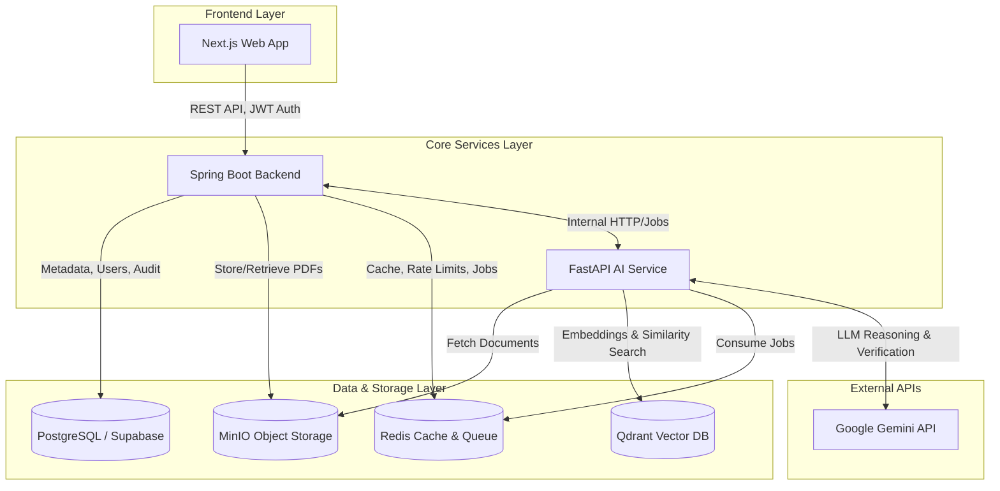
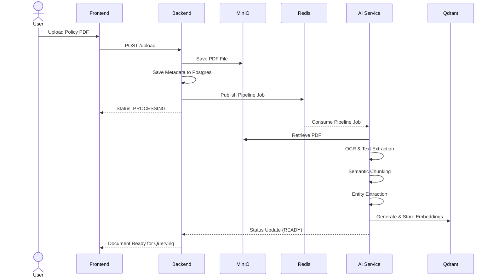
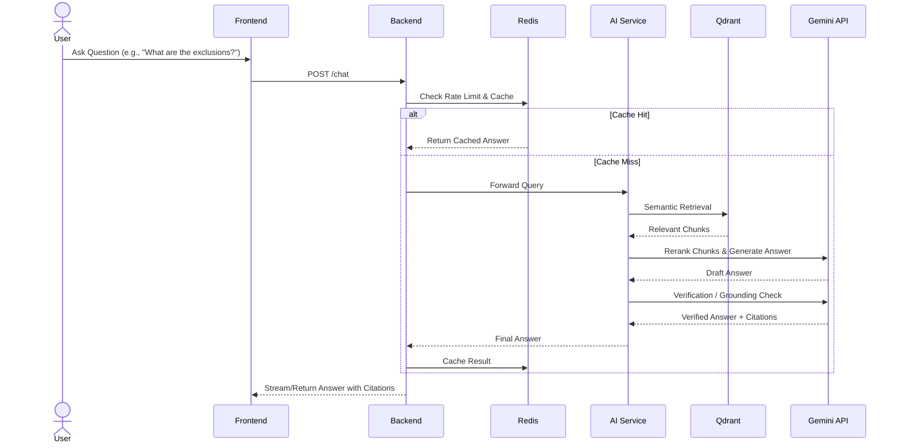

# InsuraMind 🧠💼

**An AI-Powered Insurance Intelligence Platform**

InsuraMind is a cutting-edge platform designed to transform static insurance policy documents into interactive, intelligent assets. By leveraging state-of-the-art Large Language Models (LLMs) and advanced Retrieval-Augmented Generation (RAG), InsuraMind extracts structured insights, identifies risk flags, and provides grounded, cited answers to complex policy questions.

## 🚀 Key Features
- **Intelligent Document Processing:** Automated OCR, semantic chunking, and entity extraction.
- **Context-Aware Chat:** Ask questions about specific policies and get accurate, hallucination-free answers backed by direct citations and source snippets.
- **Structured Insights & Risk Flags:** Automatically highlights crucial policy details, exclusions, and potential risks.
- **Enterprise-Grade Backend:** Built with Spring Boot for robust authentication, role-based access, and audit logging.
- **High-Performance AI Pipeline:** FastAPI-driven AI service with multi-stage reasoning and verification using Google's Gemini models.
- **Optimized Performance:** Redis-backed query caching and rate-limiting ensure fast and reliable user experiences.

---

## 🏗️ Architecture & Tech Stack

InsuraMind employs a modern, microservices-based architecture to separate concerns between user management, data orchestration, and intensive AI workloads.

### Tech Stack
- **Frontend:** Next.js (React)
- **Backend:** Java 24, Spring Boot 3.x, Maven
- **AI Service:** Python 3.12, FastAPI, Uvicorn
- **Databases & Storage:**
  - **Relational DB:** PostgreSQL (Supabase) for users, metadata, and audit logs.
  - **Object Storage:** MinIO (S3-compatible) for secure PDF document storage.
  - **Vector DB:** Qdrant for storing and querying semantic embeddings.
  - **Cache & Message Broker:** Redis for query caching, rate limiting, and AI pipeline job queues.
- **External APIs:**
  - **Google Gemini API:** Utilized for high-speed reasoning (`gemini-2.5-flash`), complex logic (`gemini-2.5-pro`), and answer verification.
  - **Embeddings:** `BAAI/bge-large-en-v1.5` for generating dense vector embeddings.

### System Architecture Diagram



---

## ⚙️ Core Workflows

### 1. Document Ingestion Pipeline

When a user uploads an insurance policy, the system processes it asynchronously to extract maximum value.



### 2. Retrieval-Augmented Chat (RAG) Flow

When a user asks a question, InsuraMind uses a multi-step RAG process with verification to ensure accuracy.



---

## 🛠️ Local Development Setup

### Prerequisites
- **Java JDK 24** (e.g., `C:\Program Files\Java\jdk-24`)
- **Maven 3.9+**
- **Python 3.12** (Conda recommended)
- **Node.js 22+**
- **Docker Desktop**

### 1. Infrastructure Startup
Copy the environment template and fill in your Supabase details and Gemini API Key:
```powershell
Copy-Item .env.example .env
```
Start the local databases and object storage:
```powershell
docker-compose up -d qdrant minio redis
```
*Note: Flyway will automatically create the `insuramind` schema in your Supabase database upon backend startup.*
- **MinIO Console:** `http://localhost:9001`

### 2. Start the Backend (Spring Boot)
```powershell
$env:JAVA_HOME='C:\Program Files\Java\jdk-24'
$env:Path="$env:JAVA_HOME\bin;$env:Path"
cd backend
mvn spring-boot:run
```
- **Backend API:** `http://localhost:8080/api`

### 3. Start the AI Service (FastAPI)
Using an Anaconda environment:
```powershell
conda activate InsuraMind
cd ai-services
python -m uvicorn main:app --reload --host 0.0.0.0 --port 8001
```
- **AI Health Check:** `http://localhost:8001/health`

### 4. Start the Frontend (Next.js)
```powershell
cd frontend
npm install
npm run dev
```
- **Frontend App:** `http://localhost:3000`

---

## 🧪 Testing the Platform

1. **Sign Up / Login:** Create an account on the frontend.
2. **Upload:** Upload a sample insurance policy PDF.
3. **Process:** Wait for the document status to transition from `PROCESSING` to `READY`.
4. **Interact:** Open the document dashboard. Review automatically generated insight cards and risk flags.
5. **Query:** Use the chat interface to ask specific questions like:
   - *"What are the key exclusions in this policy?"*
   - *"Is flood damage covered?"*
6. **Verify:** Check the returned citations and source snippets to trace the AI's answer back to the exact section in the original PDF.

---

## 🔮 Future Enhancements (Post-V1)
- Deployment orchestration with Kubernetes.
- Nginx reverse proxy with SSL termination.
- Automated CI/CD pipelines via GitHub Actions.
- Support for complex multi-document comparison.
- Agentic workflows for automated policy summarization.
